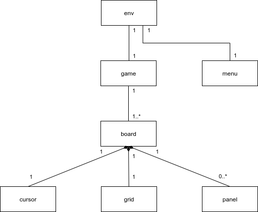

# アーキテクチャ

本稿はアプリケーションのModel部分について述べる。
ViewModelとの分離はTODO。

各モデルの要素には対応する状態遷移系があり、状態遷移は親から子へのメッセージをトリガーに引き起こされる。

## env

- ルートとなるモデル
- 外部からのイベントを受け取り、現在のモードに応じて内部イベントに振り分ける（現状、Gameに垂れ流し）
  - 入力イベント
  - Tickイベント

## game

- ゲーム進行を扱うモデル
- 複数の盤面を扱いうる（現状、単一のboardに垂れ流し）

## board

- ゲームの盤面を扱うモデル
- カーソル・グリッド・パネルを制御する